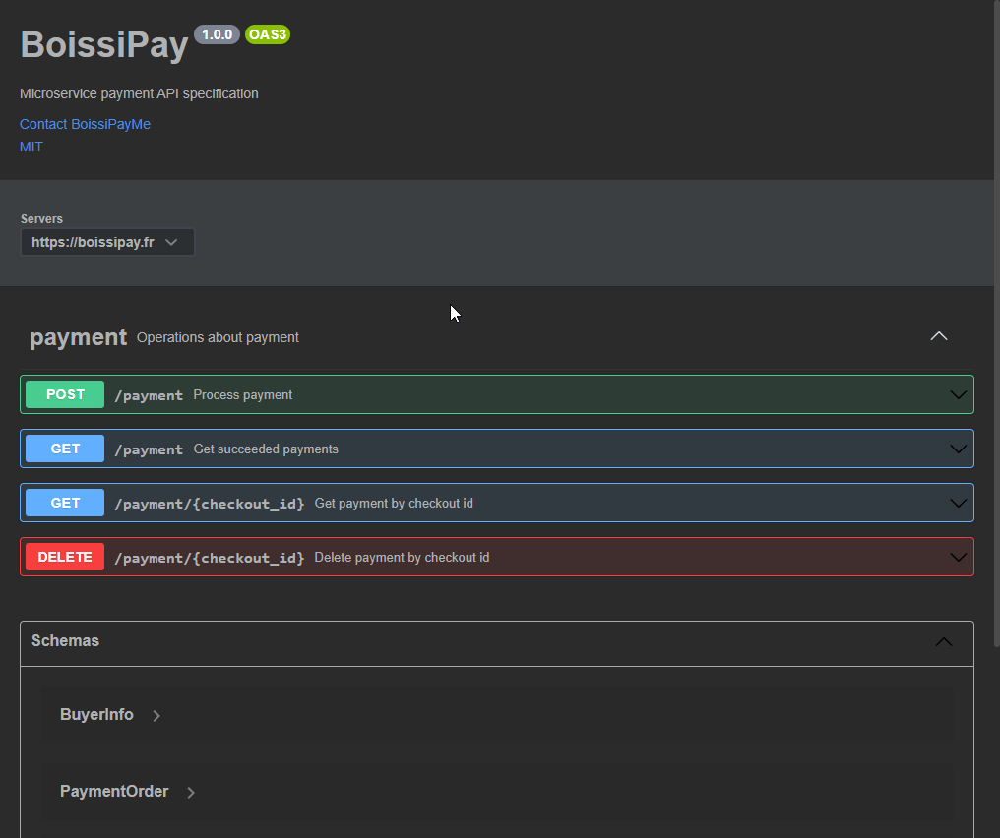
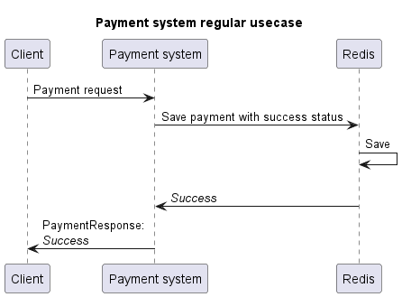
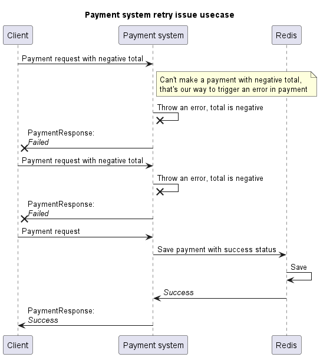
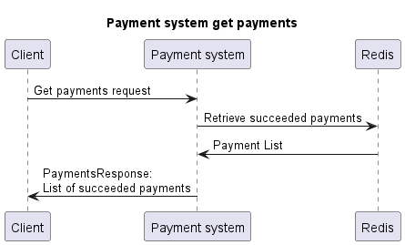
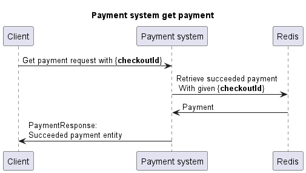
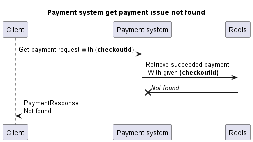
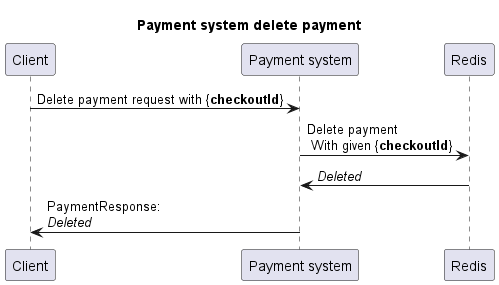
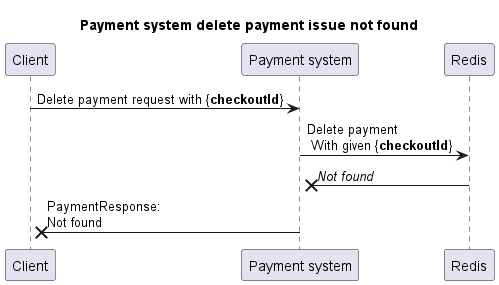

# Paiement micro-service OPEN API

> Bonne lecture et bonne correction Gregory 😍

Ce projet a pour but de fournir le design d'une API de paiement.

Cette dernière sera conçue à l'aide d'une specification Open API, qui générera un projet Spring
contenant uniquement la partie des controllers.

Ces controllers seront pris en charge par un autre module contenant des méthodes "delegate" afin d'apporter
une implémentation du fonctionnement.

Afin d'apporter un peu de "sel" 🧂 dans le projet, nous avons

- De la génération de code grâce à la spécification openapi.
- Une interaction avec une base Redis
- Une conteneurisation de la stack applicative (Dockerfile + docker-compose)
- Des tests d'intégration utilisant TestContainer

## Spécifications & Delegate

Le fichier de spécification se trouve dans le
chemin [`specification/src/main/resources/openapi.yml`](specification/src/main/resources/openapi.yml)
Et contient toute la documentation de nos routes.

Elles sont au nombre de 4 :

- **Faire un paiement** : Faire un paiement auprès de l'API, renvoie un status ainsi que l'id du paiement.
- **Récupérer les paiements** : Récupérer la liste des paiements.
- **Récupérer un paiement** : Récupérer un paiement.
- **Supprimer un paiement** : Supprimer un paiement.



Pour la partie delegate, nous utilisons un autre module nommé `boisspay` qui contient la dépendance
du code générée par le module contenant les spécifications. C'est par ce denier que nous coderons les implémentations
pour les controllers générés.

### Redis

Afin de stocker les paiements, nous utilisons une base Redis.<br>
Cette dernière va stocker les paiements effectués dans un dictionnaire, avec comme clé le `checkoutId` du paiement.

Nous utilisons une **Bean** `JedisPooled` pour gérer la connexion à la base Redis.

```java

@ConfigurationProperties("redis")
public class RedisConfiguration {
    private String host;
    private int port;
    ...
```

```java

@Configuration
public class BeanConfiguration {

    private final RedisConfiguration redisConfiguration;

    public BeanConfiguration(RedisConfiguration redisConfiguration) {
        this.redisConfiguration = redisConfiguration;
    }

    @Bean
    public JedisPooled jedisPool() {
        return new JedisPooled(redisConfiguration.getHost(), redisConfiguration.getPort());
    }
}
```

```java
jedisPool.hset("payment",payment.getCheckoutId().toString(),payment.toString());
```

## Compilation & Lancement

Pour compiler le projet, nous utilisons la commande `mvn clean install`. Sur le module parent.

Le fichier **.jar** généré se trouve ensuite dans le chemin `boissipay/target/boissipay-1.0.0.jar`.

## Docker

Pour pouvoir déployer plus rapidement notre projet, nous utilisons une image Docker fait par nos soins. Nous avons
configuré un fichier de configuration Spring qui va charger les variables environments du système pour le rendre
personnalisable via un conteneur.

```dockerfile
FROM maven:3.8.5-eclipse-temurin-17-alpine as build
WORKDIR /app
COPY pom.xml .
COPY ./boissipay/ ./boissipay/
COPY ./specification/ ./specification/
RUN mvn clean install -DskipTests

FROM openjdk:17-alpine
WORKDIR /app
COPY --from=build /app/boissipay/target/*.jar /app/boissipay.jar

EXPOSE 8080

ENV REDIS_HOST=localhost\
    REDIS_PORT=6379

CMD ["java", "-jar","-Dspring.profiles.active=env", "/app/boissipay.jar"]
```

Pour construire notre image et déployer cette dernière directement avec une base Redis, nous avons également à
disposition un fichier `docker-compose.yml` :

```yaml
version: "3.8"
services:
  redis:
    image: redis:alpine
    restart: unless-stopped
    networks:
      - boissi-net
  boissipay:
    build:
      context: .
      dockerfile: Dockerfile
    environment:
      - REDIS_HOST=redis
      - REDIS_PORT=6379
    ports:
      - "8080:8080"
    networks:
      - boissi-net
    depends_on:
      - redis

networks:
  boissi-net:
    driver: bridge
```

## Test Container

Pour certains tests d'intégration, nous avions besoin d'une base Redis. Pour pouvoir en déployer une dans le cadre de
nos tests, nous utilisons la librairie java. Cette dernière permet de lancer à la volée des conteneurs docker
paramétrables au sein des tests.

```java

@Testcontainers
class TestSpringPaymentApiDelegate {
    static final String REDIS_IMAGE = "redis:5.0.3-alpine";
    static final int REDIS_PORT = 6379;

    @Container
    public GenericContainer redis = new GenericContainer(REDIS_IMAGE)
            .withExposedPorts(REDIS_PORT);
```

## Diagrammes de séquences

Voici les différents diagrammes de séquences de nos usecase.

### Paiement





### Récupération des paiements



### Récupération d'un paiement





### Suppression d'un paiement



